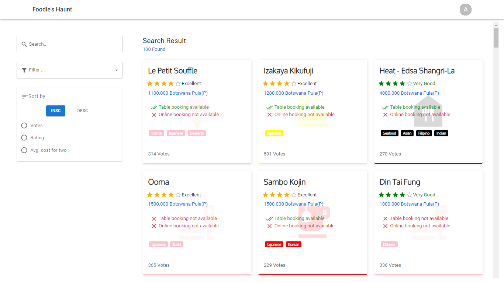
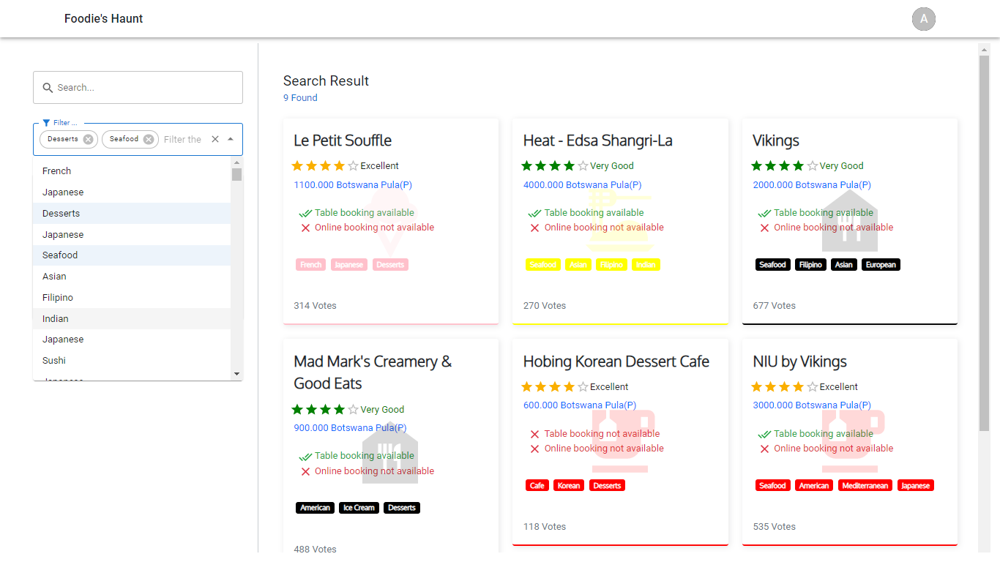
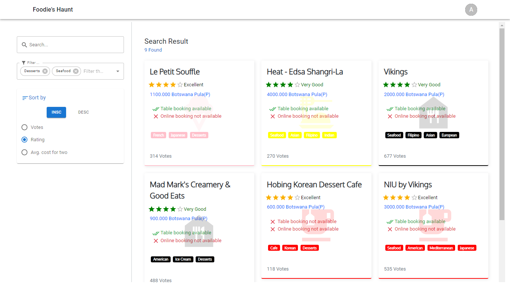
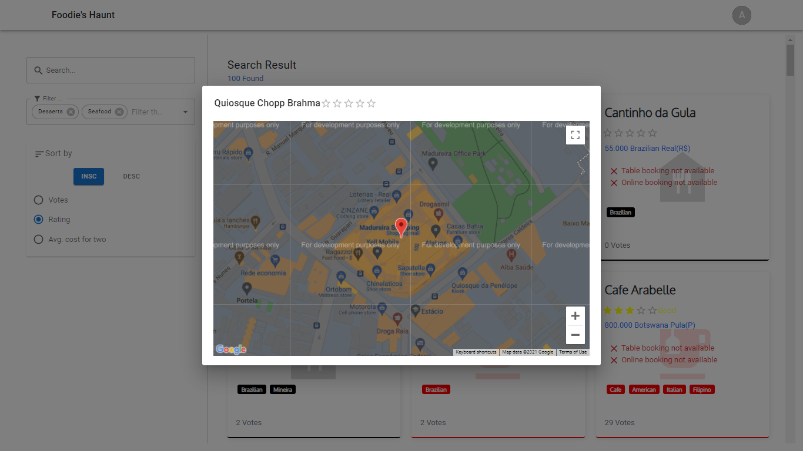
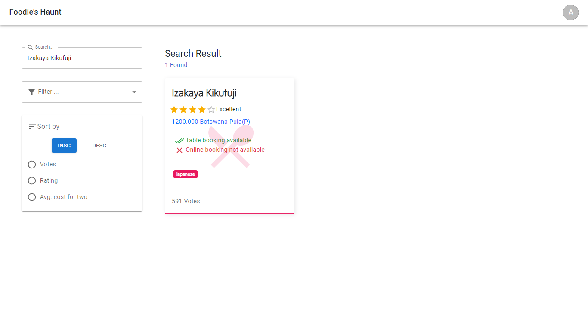

# Foodie-Hack Project Introduction

## Deployed at
   frontend - [live](https://ayushbisht2001.github.io/Foodie-frontend/)
   
   backend - [live](https://ayushbisht200121.pythonanywhere.com/)
   
## Tech Guide
    backend
      - framework used - python( Django )
      - Database used - MySql
      - Rest APIs ( DRF )
     
     frontend
        - framework used - React-JS , Material UI , Bootstrap

## Glimpse of Project
   
   

   

   

   

   

       
        
      
        
